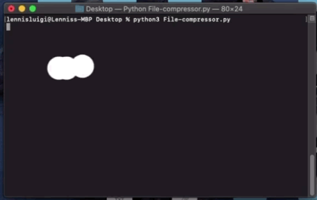

# File Compressor
This python script compresses the file size, zips the selected files and email them in seconds

Encryption of files will be implemented soon :D
 

# Requirements
<li>pip install zipfile</li> 
<li>pip install pyautogui</li>
<li>pip install smtplib</li>

Alternatively pip install -r requirements.txt

